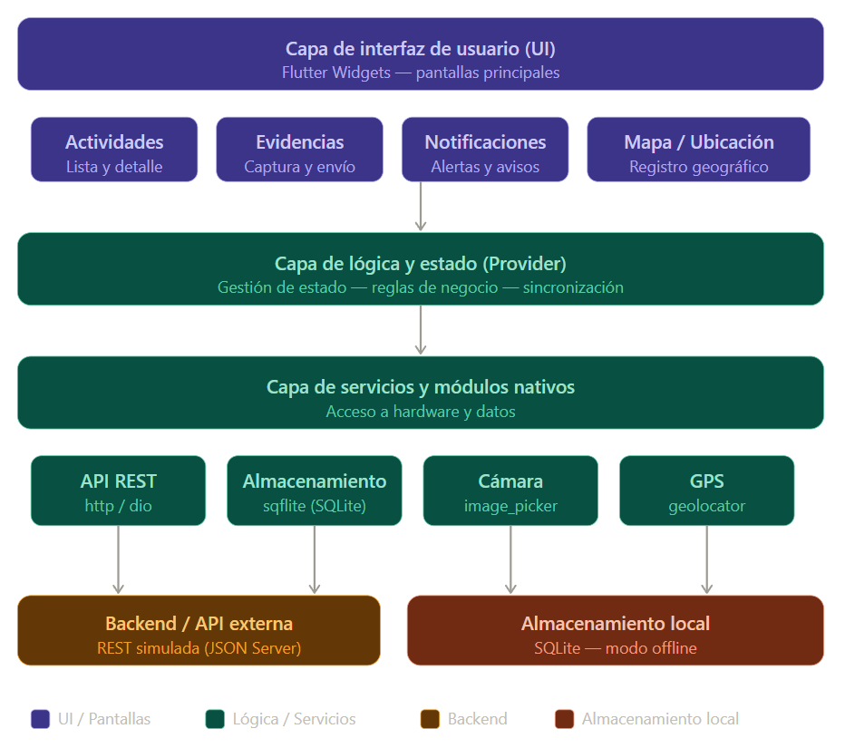

# Diseño técnico de una aplicación móvil multiplataforma para un contexto real

**Asignatura:** Lenguaje de computación para móviles  
**Unidad:** Unidad 3 — Desarrollo web multiplataforma orientado a dispositivos móviles  
**Fecha:** 2026-05-25

---

## 1. Descripción del problema

Una institución educativa necesita centralizar la comunicación académica con sus estudiantes. Actualmente la información se dispersa por múltiples canales, lo que genera pérdida de mensajes y poca trazabilidad. Adicionalmente, muchos estudiantes cuentan con conectividad limitada o intermitente, lo que dificulta el acceso oportuno a la información académica.

**Público objetivo:** Estudiantes de la institución, con dispositivos Android de gama media o baja.

**Escenarios principales de uso:**
- Consultar actividades y entregas pendientes con o sin conexión a internet.
- Recibir notificaciones cuando se publiquen nuevas actividades.
- Fotografiar y adjuntar evidencias de trabajo directamente desde la app.
- Registrar la ubicación geográfica al momento de subir una evidencia.

---

## 2. Historias de usuario

| # | Historia de usuario | Prioridad |
|---|---|---|
| 1 | Como **estudiante**, quiero consultar mis actividades académicas pendientes sin necesidad de internet, para organizar mi tiempo en cualquier lugar. | Alta |
| 2 | Como **estudiante**, quiero recibir notificaciones cuando haya una nueva actividad publicada, para no perderme entregas importantes. | Alta |
| 3 | Como **estudiante**, quiero tomar una fotografía desde la app y adjuntarla como evidencia de una actividad, para demostrar mi trabajo realizado. | Alta |
| 4 | Como **estudiante**, quiero que la app guarde la información localmente, para consultarla cuando no tenga conexión a internet. | Alta |
| 5 | Como **estudiante**, quiero que la app registre mi ubicación al subir una evidencia, para dar contexto geográfico a mi entrega. | Media |
| 6 | Como **estudiante**, quiero que la interfaz sea simple y rápida, para usarla cómodamente desde un dispositivo de gama baja. | Media |

---

## 3. Matriz comparativa de enfoques

| Criterio | PWA | Híbrida (Ionic + Capacitor) | Nativa Android | Flutter |
|---|---|---|---|---|
| **Costo de desarrollo** | Bajo | Bajo-Medio | Alto | Medio |
| **Reutilización de código** | Alta (una sola web) | Alta (iOS y Android) | Baja (código por plataforma) | Muy alta (un solo código) |
| **Acceso a cámara y GPS** | Limitado en Android | Completo vía plugins | Completo y directo | Completo vía paquetes |
| **Funcionamiento offline** | Parcial (Service Workers) | Bueno (con SQLite local) | Muy bueno | Muy bueno |
| **Rendimiento en gama baja** | Bueno | Aceptable | Excelente | Muy bueno |
| **Facilidad de mantenimiento** | Alta | Alta | Media | Alta |
| **Publicación e instalación** | No requiere tienda | Requiere Play Store | Requiere Play Store | Requiere Play Store |
| **Limitaciones principales** | No instalable fácilmente en Android; acceso nativo limitado | Depende de plugins de terceros | Costo alto; dos equipos si se quiere iOS | Curva de aprendizaje en Dart |
| **Decisión final** | ✗ | ✗ | ✗ | Seleccionado |

---

## 4. Selección tecnológica y justificación

**Enfoque seleccionado:** Aplicación compilada a nativo con **Flutter**  
**Lenguaje:** Dart

### Paquetes principales

| Necesidad | Paquete Flutter |
|---|---|
| Consumo de API REST | `http` / `dio` |
| Almacenamiento local offline | `sqflite` (SQLite) |
| Acceso a cámara | `image_picker` |
| Geolocalización | `geolocator` |
| Notificaciones locales | `flutter_local_notifications` |
| Gestión de estado | `provider` |

### Justificación de la decisión

- **Reutilización de código:** Un único proyecto corre en Android y escala a iOS en el futuro, reduciendo costos y tiempo de desarrollo.
- **Rendimiento:** Flutter compila directamente a código nativo ARM, lo que garantiza fluidez en dispositivos de gama media o baja.
- **Acceso a hardware:** Mediante paquetes oficiales se accede a cámara, GPS y almacenamiento local sin restricciones ni intermediarios.
- **Soporte offline:** SQLite integrado permite almacenar actividades localmente y sincronizar automáticamente al recuperar conexión.
- **Mantenimiento:** Un único código base es más fácil y económico de mantener que dos aplicaciones nativas separadas.
- **Costo:** Menor que el desarrollo nativo puro, con resultados de rendimiento comparables.
- **Escalabilidad:** La arquitectura por capas facilita agregar nuevas funcionalidades sin afectar los módulos existentes.

---

## 5. Arquitectura mínima viable

La arquitectura se organiza en cuatro capas bien definidas:

---

### Componentes y pantallas principales

- **Pantalla de actividades:** lista de actividades académicas consumidas desde la API y almacenadas localmente.
- **Pantalla de evidencias:** captura de fotografía con `image_picker` y registro de ubicación con `geolocator`.
- **Pantalla de notificaciones:** alertas locales gestionadas con `flutter_local_notifications`.
- **Servicio de API REST:** módulo que consume el backend externo mediante peticiones HTTP y cachea la respuesta en SQLite.
- **Módulo de almacenamiento local:** base de datos SQLite que permite consulta completa sin conexión.
- **Backend simulado:** API REST con JSON Server para desarrollo y pruebas.

---

## 6. Consideraciones móviles

| Condición | Solución propuesta |
|---|---|
| **Conectividad limitada** | SQLite local almacena actividades al primer acceso; sincronización automática al recuperar conexión. |
| **Bajo consumo de datos** | Peticiones a la API con solo los campos necesarios (JSON ligero); imágenes comprimidas antes de subirse. |
| **Rendimiento en gama baja** | Flutter compila a código nativo ARM; se evitan animaciones pesadas y se usa lazy loading en listas. |
| **Pantallas pequeñas** | Diseño responsive con widgets adaptables; tipografía mínima de 14sp; botones con área táctil ≥ 48dp. |
| **Permisos del dispositivo** | Permisos de cámara, GPS y notificaciones solicitados de forma progresiva (just-in-time) con explicación clara. |
| **Seguridad básica** | Token de sesión en secure storage; datos locales cifrados con SQLCipher. |

---

## 7. Riesgos y limitaciones

| Riesgo | Impacto | Estrategia de mitigación |
|---|---|---|
| Fallo de conexión a internet | El estudiante no puede ver actividades actualizadas | Almacenamiento local con SQLite y sincronización automática al recuperar conexión. |
| Dispositivo sin permisos de cámara o GPS | Las funciones de evidencia y ubicación no funcionan | Solicitud progresiva de permisos con explicación clara; funciones opcionales si se deniegan. |
| API externa no disponible | La app no carga datos nuevos | Caché local siempre activa; indicador visual de modo offline para el usuario. |
| Espacio de almacenamiento limitado | Las fotos llenan la memoria del dispositivo | Compresión automática de imágenes antes de guardar; límite configurable de evidencias locales. |

---

## 8. Video de sustentación

> [Ver video de sustentación](https://youtu.be/ADhSCgJlUW4)

## Referencias

- Flutter Team. (2024). *Flutter documentation*. https://flutter.dev/docs
- Dart Team. (2024). *Dart language*. https://dart.dev
- pub.dev. (2024). *sqflite*. https://pub.dev/packages/sqflite
- pub.dev. (2024). *image_picker*. https://pub.dev/packages/image_picker
- pub.dev. (2024). *geolocator*. https://pub.dev/packages/geolocator
- Google Developers. (2024). *Progressive Web Apps*. https://web.dev/progressive-web-apps
- Ionic Team. (2024). *Capacitor docs*. https://capacitorjs.com/docs

